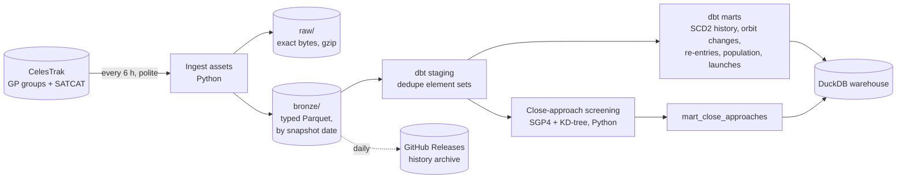

# OrbitWatch

[](https://github.com/smymuna/orbitwatch/actions/workflows/ci.yml)
[](https://github.com/smymuna/orbitwatch/actions/workflows/collect.yml)


**A space traffic data pipeline.** Every 6 hours it snapshots the orbit of every tracked
satellite and major debris cloud, keeps the full history, and models it into a warehouse
that answers questions like: *which satellites manoeuvred this week, what came back down,
who owns what is up there, and which objects will pass dangerously close in the next 24
hours?*

**First full run on GitHub Actions (7 October 2026):**

| | |
|---|---|
| Objects ever catalogued / still in orbit | **70,882 / 35,214** (20,195 satellites, 12,534 debris, 2,430 rocket bodies) |
| Biggest owners in orbit | US 18,532 (mostly Starlink), CIS 6,667, PRC 6,169 |
| Launches | 2025 was a record with **315 launches**; 3,169 of 4,492 payloads were Starlink |
| Re-entries | 25 objects came back down in the past week; 22 more have a perigee under 250 km (mostly old Starlinks being deorbited) |
| Close approaches | **19,301 objects** screened: 43,492 pairs predicted within 5 km in the next 24 h, closest **19 m** (Yaogan-35 01A × Starlink-34312, at 11.8 km/s). Verified by independent 1-second propagation. |

## Why this is a data engineering problem

The data source only gives **the present**. CelesTrak publishes the current orbit of
every object and the current catalogue, but no history. So the pipeline has to:

- **Build its own history**: keep every snapshot, immutable, and derive everything else
  from it ([ADR 0001](docs/adr/0001-build-our-own-history.md)).
- **Respect a strict source:** CelesTrak refreshes every 2 hours and answers repeat
  downloads with HTTP 403 "data has not updated". That is *nothing new*, not an error, and
  hammering it gets your IP blocked.
- **Track change over time:** a type 2 slowly changing dimension built from snapshots
  ([ADR 0002](docs/adr/0002-scd2-from-snapshots-not-dbt-snapshot.md)).
- **Do real computation:** propagate ~20,000 orbits with SGP4 and screen 200 million
  possible pairs efficiently ([ADR 0003](docs/adr/0003-close-approach-screening.md)).

## Architecture



Orchestrated by **Dagster** as software-defined assets. The dbt models are Dagster assets
too (via `dagster-dbt`), and the Python screening asset sits *between* dbt models, so
Dagster runs dbt in two parts around it. dbt tests appear as Dagster asset checks.

| Layer | Contents |
|---|---|
| `raw/` | Every download exactly as received, gzipped. Replayable. |
| `bronze/` | Typed Parquet per download, Hive-partitioned by `snapshot_date` |
| `staging` | `stg_gp_elements` (one row per distinct element set, with orbit size), `stg_satcat_daily` |
| `marts` | `dim_object`, `dim_object_history` (SCD2), `fct_element_sets`, `fct_orbit_changes`, `fct_reentries`, `mart_reentry_watch`, `mart_orbit_population`, `mart_launches_by_year`, `mart_owners_in_orbit`, `mart_close_approaches` |

## Example questions

```sql
-- Which satellites raised or lowered their orbit this week?
select object_name, change_type, round(delta_semi_major_axis_km, 2) as km, epoch
from fct_orbit_changes where epoch >= now() - interval 7 day order by epoch desc;

-- Closest predicted approaches in the next 24 hours
select object_a, object_b, round(miss_km, 3) as km, round(relative_speed_kms, 1) as kms, tca
from mart_close_approaches order by miss_km limit 10;

-- When did an object's status change? (type 2 history)
select version, ops_status_code, decay_date, valid_from, valid_to
from dim_object_history where norad_cat_id = 25544 order by version;
```

## Running it

**With Docker** (Dagster UI on http://localhost:3000):

```bash
docker compose up --build
```

Then click **Materialize all**, or turn on the 6-hourly schedule under *Automation*.

**Locally** (Python 3.12+):

```bash
python -m venv .venv && source .venv/bin/activate
pip install -e ".[dev]"
dagster dev -m orbitwatch.definitions                   # UI on :3000
# or headless:
dagster job execute -m orbitwatch.definitions -j refresh
duckdb data/warehouse.duckdb                            # explore the marts
```

To start from the published archive instead of an empty history, download `bronze-*.tar.gz`
files from the [data releases](https://github.com/smymuna/orbitwatch/releases) and extract
them into `data/`.

## Data quality

- **Ingestion:** the client checks every payload really is JSON or the expected CSV
  (CelesTrak answers unknown groups with HTTP 200 and a text message); typed parsing
  fails loudly on malformed records instead of loading them.
- **dbt tests:** unique element sets, value ranges (eccentricity, inclination, mean
  motion), accepted values, perigee below apogee, history versions contiguous.
- **Asset checks:** the catalogue looks complete (≥ 60,000 objects); the active-satellite
  count did not drop by more than 10% between snapshots (a truncated download, not
  satellites vanishing).

## Engineering

- **Tests:** 34 tests, 95% coverage. Parsers run on real captured CelesTrak payloads,
  including its "not updated" and "invalid group" replies. Screening is checked against a
  brute-force propagation (agreement within 50 m) and real debris data. An **offline
  end-to-end test** runs Dagster + dbt + DuckDB over two simulated days and asserts that
  an injected ISS reboost is detected as a +2 km orbit raise, and that a re-entry creates a
  new history version.
- **Static checks:** `ruff`, `mypy --strict`, `dagster definitions validate`.
- **CI:** lint, types, tests, Docker build with a UI smoke test.
- **Collect workflow:** daily GitHub Actions run that restores 90 days of history from
  releases, runs the pipeline, and publishes the day's snapshot and warehouse.

## Limitations

- **History starts on 7 October 2026 (UTC),** the first snapshot. Orbit-change detection needs
  element sets from different days, so it fills in as the archive grows.
- **Close approaches are screening candidates,** not collision probabilities: SGP4 with GP
  elements is accurate to about 1 km at epoch and degrades by a few km per day, with no
  covariance information. A predicted 19 m pass means "within the uncertainty", not "they
  will touch". The volume is plausible: SpaceX reports ~275 collision-avoidance manoeuvres a
  day at much tighter thresholds, and the distribution of miss distances matches what random
  crossings within 5 km predict.
- **Manoeuvre detection is a heuristic:** drag only lowers orbits, so a raise above
  0.5 km between element sets is treated as a burn. Thresholds are dbt variables.
- **Coverage:** active satellites plus four major debris clouds, not every tracked
  fragment (CelesTrak publishes the full catalogue's orbits in other groups).
- **Single-file warehouse:** DuckDB is ideal at this size (tens of millions of rows). A
  shared deployment would move bronze to object storage and the warehouse to a server.

## Data and licence

Orbital data and the satellite catalogue from [CelesTrak](https://celestrak.org)
(Dr T.S. Kelso), derived from US Space Force tracking data. Please follow CelesTrak's
usage guidance: download each group at most once per update (every 2 hours).

Code: MIT, see [LICENSE](LICENSE).
